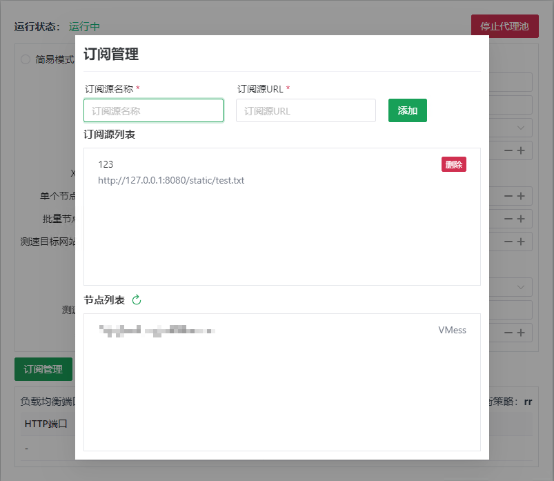
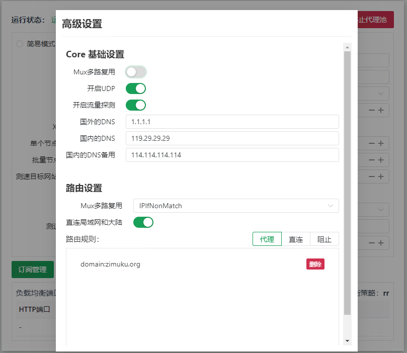
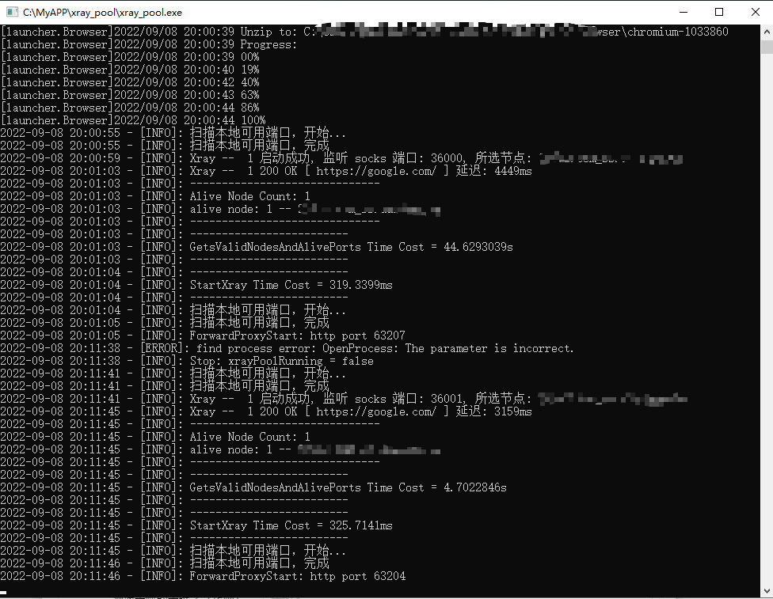
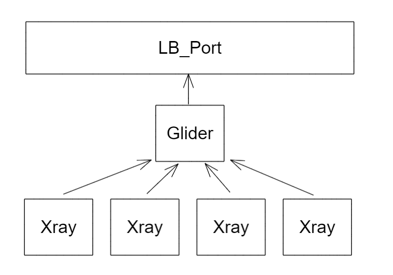
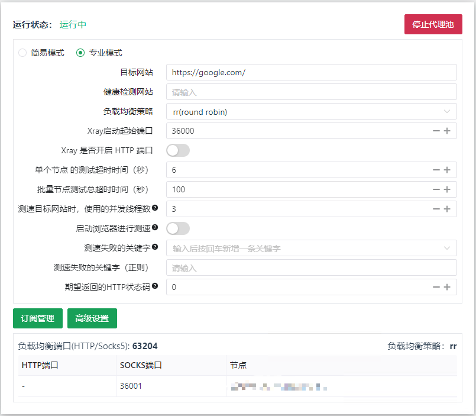

# xray_pool

## 前言

本软件的目标是短平快的提供一个多协议支持的代理池，针对目标网站筛选出有效的节点去访问，输出一个使用负载均衡策的 HTTP 端口（暂时默认：round robin）。

当然也是可以当 V2rayN 来使用的，开启 Xray 多个代理节点后，无需因为一个节点的故障，手动去切换节点。

## 该软件适用于什么情况

1. 鸡场支持：VMess、Shadowsocks、Trojan、VLESS、VMessAEAD、Socks 协议
2. 鸡场不限制客户端数量，或者数量大于 5（太少没有意义）
3. 爬虫任务需要每一次 HTTP 请求就切换一个代理

## 软件界面






## 运行流程

第一次运行，需要下载 Chrome，作为一些特殊的目标网站检测使用。

1. 扫描本地可用的端口
2. 针对所有的节点进行对目标网站的测试
3. 得到可用的节点列表
4. 扫描本地可用的端口
5. 通过 xray 启动可用的节点
6. 使用 glider 进行负载均衡中转



## 软件结构图

本程序可以理解为就是一个壳，调用两个核心程序来实现的（实现的代价最低，可维护性也最高）。

为了对外暴露一个负载均衡的 HTTP 代理端口（负载均衡策略是 round robin），所以使用了 [glider](https://github.com/nadoo/glider) 这个软件。



## 如何使用

> 还没有做自动化编译
>
> 任何故障请去看`base_things`同级的 `Log`文件夹中的日志，偷懒没有传递太多信息到 Web UI 上。

### 如何启动

#### Window

1. 下载编译好的程序，放到任意目录中。比如在 `D:\Xray_Pool` 中
2. 在`D:\Xray_Pool`中新建一个文件夹`base_things`
3. 去 [XTLS/Xray-core](https://github.com/XTLS/Xray-core/releases) 和 [nadoo/glider](https://github.com/nadoo/glider/releases) 对应平台和架构的程序，解压到`base_things`中
4. 双击启动 `D:\Xray_Pool\xray_pool.exe`
5. Windows 防火墙会提示有程序访问网络，选择同意
6. 使用本地浏览器打开 http://127.0.0.1:19035
8. 添加 V2RAY 鸡场提供的订阅源，更新节点
9. 输入目标网站，点击启动代理池，根据反馈的信息得到已经开启有哪些端口（负载均衡端口、Socks5端口、HTTP 端口）

#### Linux

1. 下载编译好的程序，放到任意目录中。
2. 在 `/config`中新建一个文件夹`base_things`
3. 后续参考 Windows 部分

#### MacOS

1. 下载编译好的程序，放到任意目录中。
2. 在 `/.config/xray_pool`中新建一个文件夹`base_things`
3. 后续参考 Windows 部分

#### Docker

待实现

### 使用 API 接口

> 因为目标是给爬虫使用，那么考虑到开启的端口会很多，所以都是使用一个地址段的随机端口来启动的。
>
> 所以建议使用 API 来获取开启的端口信息

因为接口是动态的，那么支持外部的程序通过 http api 获取这些信息

Url: `127.0.0.1:19035/v1/proxy_list`

请求方式：GET

返回的内容：

```json
{
	"status": "running",
	"lb_port": 63204, // 负载均衡端口
	"open_result_list": [
		{
			"name": "节点的名称",
			"proto_model": "VMess",
			"socks_port": 36001,
			"http_port": 0 // 没有开启，非 0 则是开启
		}
	]
}
```

### 专业模式说明




这里举例子来说明为什么有这些设置，以及怎么设置去应对目标网站的策略：

假如你的目标爬取的网站是：ABC.com

它有以下的反爬策略和表现：

1. 检测一般的 HttpClient 访问，无法正常返回页面数据
2. 一个 IP 每 30 分钟只允许 10 次访问
3. 进入主页前会跳转到一个验证的页面，这个页面人可以看到验证码，但是页面的 StatusCode 是 400
4. 被屏蔽的时候，页面会返回一个特殊的关键词：HAHA

那么设置如下：

1. 目标网站：ABC.com。
2. 健康检测网站：留空，因为反爬策略，不要浪费访问的次数。针对上面的，2。
3. 启动浏览器进行测速，开启。针对上面的，1。
4. 并发线程数：3。注意，这个跟你的电脑性能和带宽相关，请合理设置。
5. 失败的关键字：HAHA。针对上面的， 4。

那么其他情况，请举一反三。

## TODO

* 根据每个订阅源的节点命名规则，识别流量的倍率，优先选择低倍率的节点去使用
* ~~提供额外的负载均衡测率的设置~~
* 运行日志在 WebUI 呈现

## Thanks

* [Txray](https://github.com/hsernos/Txray)
* [XTLS/Xray-core](https://github.com/XTLS/Xray-core)
* [glider](https://github.com/nadoo/glider)