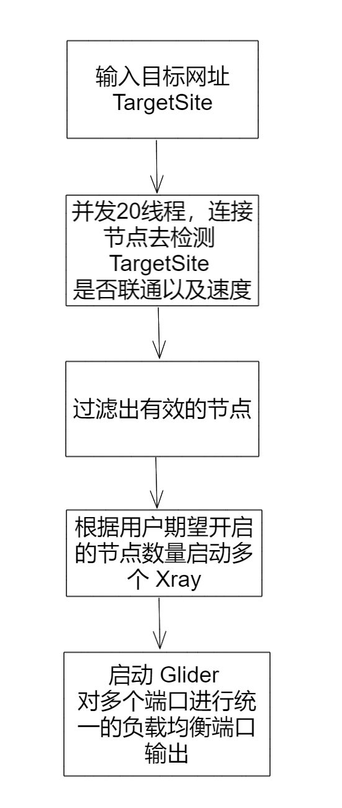

# xray_pool

## 前言

本软件的目标是短平快的提供一个多协议输入源支持的代理池，针对目标网站筛选出有效的节点去访问，同时带有相应的负载均衡策略（暂时默认：round robin）。

## 该软件适用于什么情况

1. 鸡场支持：VMess、Shadowsocks、Trojan、VLESS、VMessAEAD、Socks 协议
2. 鸡场不限制客户端数量，或者数量大于 5（太少没有意义）
3. 爬虫任务需要每一次 HTTP 请求就切换一个代理

## 软件界面

待实现

## 软件结构图

本程序可以理解为就是一个壳，调用两个核心程序来实现的（实现的代价最低，可维护性也最高）。

为了对外暴露一个负载均衡的 HTTP 代理端口（负载均衡策略是 round robin），所以使用了 [glider](https://github.com/nadoo/glider) 这个软件。

## 启动的流程

## 如何使用

> 还没有做自动化编译，先对接前端再继续做

### Window

1. 下载编译好的程序，放到任意目录中。比如在 `D:\Xray_Pool` 中
2. 在`D:\Xray_Pool`中新建一个文件夹`base_things`
3. 去 [XTLS/Xray-core](https://github.com/XTLS/Xray-core/releases) 和 [nadoo/glider](https://github.com/nadoo/glider/releases) 对应平台和架构的程序，解压到`base_things`中
4. 双击启动 `D:\Xray_Pool\xray_pool.exe`
5. Windows 防火墙会提示有程序访问网络，选择同意
6. 使用本地浏览器打开 http://127.0.0.1:19035
7. 进行初始化操作，填写账号、密码，登录
8. 添加 V2RAY 鸡场提供的订阅源，更新节点
9. 输入目标网站，点击启动代理池，根据反馈的信息得到已经开启有哪些端口（负载均衡端口、Socks5端口、HTTP 端口）

### Linux

1. 下载编译好的程序，放到任意目录中。
2. 在 `/config`中新建一个文件夹`base_things`
3. 后续参考 Windows 部分

### MacOS

1. 下载编译好的程序，放到任意目录中。
2. 在 `/.config/xray_pool`中新建一个文件夹`base_things`
3. 后续参考 Windows 部分

### Docker

待实现

## API 接口

待实现

## 缺陷

内存占用很高，开启的 Xray 实例越多，也就越高。

因为是短平快的玩具，所以使用了第三方的程序，开启多个代理的时候就是启动了多个程序，内存占用一定是很高的，一个 Xray 大概 13MB。

> Glider 也有支持 VMESS 等协议，但是依然是无法与 Xray 这样的项目来对比的

## Thanks

* [Txray](https://github.com/hsernos/Txray)
* [XTLS/Xray-core](https://github.com/XTLS/Xray-core)
* [glider](https://github.com/nadoo/glider)